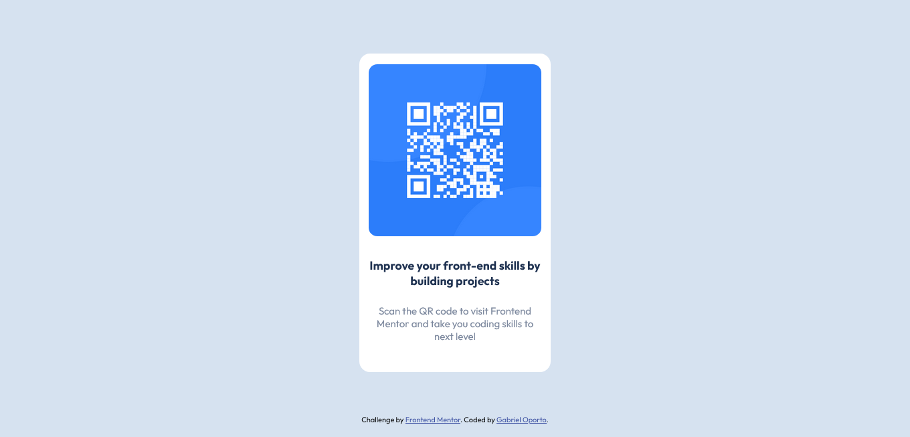

# Frontend Mentor - QR code component solution

This is a solution to the [QR code component challenge on Frontend Mentor](https://www.frontendmentor.io/challenges/qr-code-component-iux_sIO_H).

## Table of contents

- [Overview](#overview)
  - [Screenshot](#screenshot)
  - [Links](#links)
- [My process](#my-process)
  - [Built with](#built-with)
  - [What I learned](#what-i-learned)
  - [Continued development](#continued-development)
  - [Useful resources](#useful-resources)
- [Author](#author)

## Overview

### Screenshot

### Links

- Solution : [Repository](https://github.com/gabrieloporto/qr-code-component-main)
- Live Site : [Web page](https://gabrieloporto.github.io/qr-code-component-main)

## My process

### Built with

- HTML5
- CSS
- Flexbox
- Responsive Design
- Mobile-first workflow

### What I learned

This project helped me reinforce and put into practice what I learned about html and css.

### Continued development

My path as a developer will continue to be focused on the front-end, learning technologies like Javascript and React.

### Useful resources

- [Mdn](https://developer.mozilla.org/en-US/docs/Web/CSS) - The first page I go to for any questions is MDN.
- [Css reference](https://cssreference.io/) - The second page is css reference, this is a more visual and friendlier guide to understand.

## Author

- Frontend Mentor - [@gabrieloporto](https://www.frontendmentor.io/profile/gabrieloporto)
- Github - [gabrieloporto](https://github.com/gabrieloporto)
